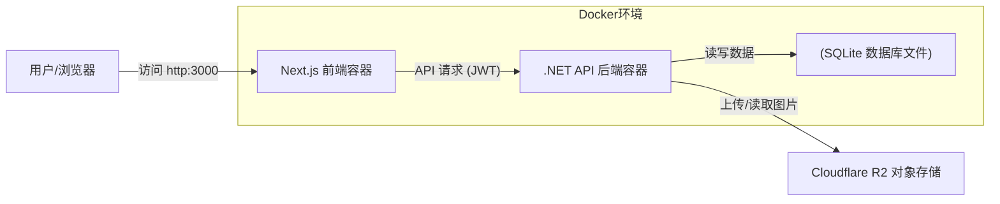

# MyNextBlog - 现代全栈技术博客系统 🚀


这是一个为开发者打造的、基于 **Headless（无头）架构** 的现代化博客系统。它将企业级的 **.NET 10 Web API** 后端与 极速的 **Next.js 15** 前端相结合，提供极致的性能和开发体验。

项目已从传统的 MVC 架构成功迁移至彻底的前后端分离架构，实现了更灵活的扩展和更优的维护性。

> **适合人群**：想搭建个人独立博客的开发者、想学习 .NET/Next.js 全栈开发的初学者、想体验 Headless 架构的极客。

---

## 📚 目录

- [✨ 核心特性](#-核心特性)
- [🏗️ 系统架构](#-系统架构)
- [🛠️ 技术栈详情](#-技术栈详情)
- [🚀 快速开始 (保姆级教程)](#-快速开始-保姆级教程)
  - [1. 环境准备](#1-环境准备)
  - [2. 关键：配置云存储 (R2)](#2-关键配置云存储-r2)
  - [3. 配置文件 (.env)](#3-配置文件-env)
  - [4. 一键启动](#4-一键启动)
  - [5. 初始化管理员账号](#5-初始化管理员账号-重要)
- [💻 使用指南](#-使用指南)
- [❓ 常见问题排查](#-常见问题排查)
- [📅 未来规划](#-future-roadmap-未来规划)

---

## ✨ 核心特性

### 🚀 最近更新 (2025-12-06)
-   **工程化升级**: 引入 **Serilog** 结构化日志与 **SQLite** 自动云备份 (R2)。
-   **DTO 重构**: 全面重构 API，引入 DTO 模式，前后端解耦更彻底。
-   **体验优化**: 实现用户自定义头像上传，优化 Markdown 表格与摘要显示。
-   **无障碍支持**: 修复对比度与 ARIA 标签，Lighthouse 无障碍评分大幅提升。

### ✨ 核心功能
*   **彻底的前后端分离**: 前端只管页面，后端只管数据。结构清晰，易于维护。
*   **所见即所得的 Markdown 编辑**: 
    *   支持 **Ctrl+V 粘贴图片**，自动**压缩转 WebP** 并上传到云端（R2）。
    *   支持实时预览，代码高亮。
*   **优雅的 UI 设计**: 基于 Tailwind CSS v4 和 shadcn/ui 构建，响应式设计完美适配移动端。
    *   ✅ **移动端适配**: 管理后台自动切换卡片式布局，无横向滚动条。
*   **基于 JWT 的安全认证**: 
    *   核心 API 均采用 JWT (Bearer Token) 认证，确保无状态和安全性。
    *   *注：为了兼容性和部分旧有逻辑，Cookie 认证仍作为默认 Scheme 保留，但 API 交互已全面转向 JWT。*
*   **功能完善的文章管理**:
    *   ✅ **分类管理**: 发文时支持直接新建分类。
    *   ✅ **标签系统**: 动态标签输入，支持多对多关联，侧边栏热门标签自动统计。
    *   ✅ **全文搜索**: 支持标题和内容的关键词搜索，支持标签精确筛选。
    *   ✅ **分页加载**: 后台文章管理支持服务端分页，首页支持“加载更多”。
    *   ✅ **智能摘要**: 自动清洗 Markdown 符号，生成纯文本摘要。
*   **丰富的内容展示**:
    *   ✅ **文章目录 (TOC)**: 详情页自动生成悬浮目录，支持平滑滚动。
    *   ✅ **表格自适应**: 移动端表格自动支持横向滚动，防止布局溢出。
    *   ✅ **猫咪相册**: 自动聚合带有“猫”标签的图片，采用瀑布流+灯箱展示。
*   **深度用户交互**:
    *   ✅ **自定义头像**: 用户可以上传并设置自己的个性化头像。
    *   ✅ **SEO 增强**: 自动生成 Sitemap，针对 LCP 和无障碍性进行了深度优化。
*   **Docker 容器化**: 提供完整的 `docker-compose` 配置，一键拉起前后端及数据库。
*   **低成本托管**: 数据库采用 SQLite（文件型），图片存储集成 Cloudflare R2（10GB 免费），适合个人站长。

---

## 🏗️ 系统架构



---

## 🏗️ 模块架构与实现细节

### 🆔 用户系统 (Identity)
*   **JWT 认证**: 采用无状态的 JWT (JSON Web Token) 机制，前后端分离认证。
*   **自定义头像**: 
    *   支持用户在“个人设置”页上传头像。
    *   后端 `AccountController` 处理上传，将图片存入 Cloudflare R2 并更新用户资料。
    *   前端 `AuthContext` 实时同步用户信息，Navbar 优先显示自定义头像。
*   **权限控制**: 基于 Policy 的授权策略，确保只有管理员能访问后台发布接口。

### 📝 内容管理 (CMS)
*   **文章系统**: 
    *   完整的 CRUD 功能，支持软删除（隐藏文章）和分页查询。
    *   **Markdown 渲染**: 前端使用 `react-markdown` + `rehype-highlight`，支持代码高亮、表格自适应（移动端横向滚动）。
*   **智能目录 (TOC)**: 解析文章内容自动生成悬浮目录，支持锚点跳转。
*   **标签系统**: 多对多实体关系，自动统计热门标签。

### 🖼️ 媒体与性能 (Media & Perf)
*   **Cloudflare R2 集成**: 
    *   图片直传对象存储，节省服务器带宽。
    *   支持 `Ctrl+V` 粘贴上传，自动重命名防止冲突。
*   **极致性能优化**:
    *   **LCP (最大内容绘制)**: 首屏关键图片强制预加载 (`priority`)，消除布局偏移 (CLS)。
    *   **无障碍 (A11y)**: 全站符合 WCAG 标准，优化颜色对比度和屏幕阅读器支持。
*   **SEO 友好**:
    *   **动态 Sitemap**: 自动生成 `sitemap.xml`，实时收录最新文章。
    *   **语义化标签**: 使用正确的 HTML5 标签 (`article`, `nav`, `aside`)。

---

## 🛠️ 技术栈详情

| 领域 | 技术 | 说明 |
| :--- | :--- | :--- |
| **前端** | Next.js 15 (App Router) | 业内最流行的 React 框架，支持服务端渲染 (SSR) |
| | TypeScript | 强类型 JavaScript，减少 Bug |
| | Tailwind CSS v4 | 原子化 CSS 框架，写样式飞快 |
| | shadcn/ui | 高质量、可复制的 UI 组件库 |
| **后端** | .NET 10 (Preview) | 微软最新的高性能开发平台 |
| | ASP.NET Core Web API | 构建 RESTful API 的标准框架 |
| | Entity Framework Core | 强大的 ORM，操作数据库不用写 SQL |
| **数据** | SQLite | 轻量级文件数据库，免安装，备份方便 |
| **存储** | Cloudflare R2 | 兼容 AWS S3 协议的对象存储，**免流量费** |

---

## 🚀 快速开始 (保姆级教程)

### 1. 环境准备
在开始之前，请确保你的电脑安装了：
*   **Git**: [下载 Git](https://git-scm.com/)
*   **Docker Desktop**: [下载 Docker](https://www.docker.com/products/docker-desktop/) (安装好后请启动它)

克隆项目到本地：
```bash
git clone https://github.com/your-username/MyNextBlog.git
cd MyNextBlog
```

### 2. 关键：配置云存储 (R2)
为了让博客能上传图片（头像、文章配图），我们需要配置免费的 Cloudflare R2。
> *如果不想配 R2，图片上传功能将无法使用，但不影响博客启动。*

1.  注册/登录 [Cloudflare Dashboard](https://dash.cloudflare.com/)。
2.  在左侧菜单点击 **R2**。
3.  点击 **Create Bucket (创建存储桶)**，起个名字（比如 `my-blog-images`），位置选 `Automatic` 或离你近的，点击创建。
4.  **获取密钥**:
    *   回到 R2 主页，右侧点击 **Manage R2 API Tokens (管理 R2 API 令牌)**。
    *   点击 **Create API Token**。
    *   **Permissions**: 选择 **Admin Read & Write**。
    *   点击 Create。
    *   **保存好以下信息**（只显示一次）：
        *   `Access Key ID`
        *   `Secret Access Key`
        *   `Endpoint` (这是你的 Service URL)
5.  **设置公开访问**:
    *   回到你的存储桶 (`my-blog-images`) -> **Settings** -> **Public Access**。
    *   你可以开启 **R2.dev subdomain** (获得一个临时域名)，或者绑定你自己的自定义域名。
    *   记下这个域名，这是 `R2_PUBLIC_DOMAIN`。

### 3. 配置文件 (.env)
在项目根目录下创建一个名为 `.env` 的文件（不要叫 `env.txt`，就是 `.env`），复制以下内容并填入刚才获取的信息：

```env
# === 数据库配置 (无需修改) ===
ConnectionStrings__DefaultConnection="Data Source=/app/data/blog.db"

# === Cloudflare R2 配置 (填入第2步获取的信息) ===
# 注意：Service URL 应该长这样：https://<AccountID>.r2.cloudflarestorage.com
R2_SERVICE_URL=https://xxxxxxxx.r2.cloudflarestorage.com
R2_ACCESS_KEY=你的AccessKeyID
R2_SECRET_KEY=你的SecretAccessKey
R2_BUCKET_NAME=你的存储桶名字(例如 my-blog-images)
R2_PUBLIC_DOMAIN=https://你的公开访问域名.r2.dev

# === 安全配置 ===
# 随便乱打一串长字符作为密钥，越长越安全
JWT_SECRET=MySuperSecretKeyForBlog_ChangeThisToSomethingRandom123!
JWT_ISSUER=MyNextBlogServer
JWT_AUDIENCE=MyNextBlogClient
```

### 4. 一键启动
打开终端，在项目根目录下运行：

```bash
docker compose up -d
```

*   Docker 会开始下载环境并编译代码（第一次可能需要几分钟，取决于网速）。
*   当看到 `Container myblog-backend Started` 和 `Container myblog-frontend Started` 时，说明启动成功！

访问浏览器：
*   **博客首页**: [http://localhost:3000](http://localhost:3000)
*   **后端 API**: [http://localhost:8080/api/posts](http://localhost:8080/api/posts)

### 5. 初始化管理员账号 (重要)
首次启动后，数据库是空的。你需要注册一个用户并将其手动升级为管理员，才能进入后台写文章。

1.  **注册用户**:
    *   访问 [http://localhost:3000/login](http://localhost:3000/login)。
    *   点击“没有账号？”，注册一个新用户（例如用户名 `admin`，密码 `123456`）。
    *   注册成功后会尝试登录，但此时你只是**普通用户**，看不到后台入口。

2.  **升级为管理员**:
    *   我们需要直接修改数据库。由于数据库文件映射在本地 `data/blog.db`。
    *   你需要一个 SQLite 工具（推荐 [DB Browser for SQLite](https://sqlitebrowser.org/) 或 VSCode 插件）。
    *   **小白简单法** (使用 Docker 命令修改):
        打开终端，运行以下命令（假设你的用户名是 `admin`）：
        ```bash
        # 进入后端容器并执行 SQL 更新命令
        docker exec -it myblog-backend sh -c "apt-get update && apk add sqlite && sqlite3 /app/data/blog.db \"UPDATE Users SET Role = 'Admin' WHERE Username = 'admin';\""
        ```
    *   **最稳妥法 (推荐)**:
        1. 下载 [DB Browser for SQLite](https://sqlitebrowser.org/)。
        2. 打开项目目录下的 `data/blog.db` 文件。
        3. 切换到 `Browse Data` 标签，选择 `Users` 表。
        4. 找到你的用户，把 `Role` 字段的值从 `User` 改为 `Admin`。
        5. 点击 `Write Changes` 保存。

3.  **完成**: 刷新浏览器，右上角头像菜单中会出现 **"管理后台"**。

---

## 💻 使用指南

*   **写文章**: 进入 [http://localhost:3000/admin](http://localhost:3000/admin)，点击右上角“新建文章”。支持 Markdown 语法。
*   **分类与标签**: 
    *   分类：点击 "+" 按钮可直接新建分类。
    *   标签：输入标签名后按回车生成，支持多个标签。
*   **上传图片**: 在编辑器中，直接 `Ctrl+V` 粘贴截图，或者拖拽图片到编辑区。
*   **更换头像/猫咪图片**: 修改 `frontend/lib/constants.ts` 文件中的链接，然后重新构建。

---

## ❓ 常见问题排查

**Q1: 启动时报错 `bind: address already in use`**
*   **原因**: 端口被占用了。
*   **解决**: 检查是否有其他程序占用了 `3000` 或 `8080` 端口。或者修改 `docker-compose.yml` 中的端口映射（例如改为 `"3001:3000"`）。

**Q2: 图片上传失败，提示 Error**
*   **原因**: R2 配置错误。
*   **解决**: 
    1. 检查 `.env` 文件是否填写正确。
    2. 检查 R2 的 API Token 权限是否为 **Admin Read & Write**。
    3. 检查 `R2_BUCKET_NAME` 是否和 Cloudflare 上的一致。
    4. 修改配置后，必须运行 `docker compose down` 和 `docker compose up -d` 重启容器。

**Q3: 页面显示 "Unknown" 或无法加载文章**
*   **原因**: 前端连接不上后端。
*   **解决**: 确保 `.env` 文件存在。Docker 内部通信依赖 `BACKEND_URL` 环境变量（默认配置已处理，通常不需要动）。尝试重启 Docker Desktop。

---

## 📅 Future Roadmap (未来规划)

虽然目前系统已具备核心功能，但我们仍有宏大的计划：

- [x] **🔍 全文搜索**: 实现基于关键词的文章搜索功能。
- [x] **🏷️ 动态标签**: 从文章内容自动提取或统计热门标签。
- [x] **📱 移动端适配**: 完善的管理后台移动端体验。
- [x] **🐱 猫咪相册**: 专属的瀑布流图片墙，展示更多猫片。
- [ ] **🌙 暗黑模式**: 支持 Light/Dark 主题一键切换。
- [x] **📑 文章目录**: 长文详情页增加悬浮目录 (TOC)。
- [ ] **📡 RSS 订阅**: 支持 RSS/Atom 订阅源。
- [ ] **📊 流量统计**: 集成简单的访问量统计功能。

---

Made with ❤️ by [Zhuchaofan](https://zhuchaofan.online)
