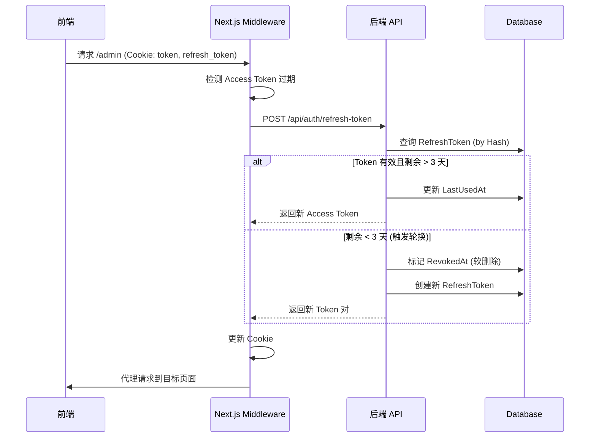

# 认证系统架构 (Authentication System)

> **最后更新**: 2026-01-24
> **负责模块**: `backend/Services/AuthService.cs`, `frontend/lib/tokenRefresh.ts`

---

## 1. 架构概览

本系统采用 **BFF (Backend for Frontend)** 认证模式，核心特性：

| 组件              | 说明                                       |
| ----------------- | ------------------------------------------ |
| **Access Token**  | JWT，15 分钟有效期，存储于 HttpOnly Cookie |
| **Refresh Token** | 随机字符串 SHA256 哈希存储，7 天有效期     |
| **存储策略**      | HttpOnly Cookie (严禁 LocalStorage)        |
| **多设备支持**    | 每个设备独立 Refresh Token，互不影响       |

---

## 2. Token 刷新流程



---

## 3. 并发刷新处理 (2026-01 新增)

### 问题背景

当 Access Token 过期时，同一浏览器的多个标签页可能同时发起刷新请求，导致：

- 请求 A 成功轮换 Token
- 请求 B 使用旧 Token 刷新失败 → 401 错误

### 解决方案：软删除 + 10 秒宽限期

```csharp
// RefreshToken.cs
public DateTime? RevokedAt { get; set; }

public bool IsActive(DateTime now)
{
    return now < ExpiryTime &&
           (RevokedAt == null || now < RevokedAt.Value.AddSeconds(10));
}
```

**核心逻辑**：

1. **首次轮换**：标记 `RevokedAt = now`，生成新 Token
2. **宽限期内再次刷新**：允许生成**并行 Token 链** (各标签页独立)
3. **宽限期后**：视为重放攻击，拒绝刷新

### 懒惰清理

每次刷新时顺手清理该用户的过期 Token：

```csharp
// 清理条件：已过期 OR 撤销超过 1 分钟
var expiredTokens = await context.RefreshTokens
    .Where(rt => rt.UserId == userId &&
                 (rt.ExpiryTime < now ||
                  (rt.RevokedAt != null && rt.RevokedAt < now.AddMinutes(-1))))
    .ToListAsync();
```

---

## 4. 数据模型

### RefreshToken 实体

| 字段         | 类型      | 说明                   |
| ------------ | --------- | ---------------------- |
| `Id`         | int       | 主键                   |
| `UserId`     | int       | 关联用户               |
| `TokenHash`  | string    | SHA256 哈希 (安全存储) |
| `ExpiryTime` | DateTime  | 过期时间 (7 天)        |
| `DeviceInfo` | string?   | 设备标识 (可选)        |
| `CreatedAt`  | DateTime  | 创建时间               |
| `LastUsedAt` | DateTime  | 最后使用时间           |
| `RevokedAt`  | DateTime? | 撤销时间 (软删除)      |

---

## 5. 安全考量

| 风险               | 缓解措施                                     |
| ------------------ | -------------------------------------------- |
| Token 泄露         | 仅存储 SHA256 哈希，即使数据库泄露也无法使用 |
| XSS 攻击           | HttpOnly Cookie，JS 无法读取                 |
| CSRF 攻击          | SameSite=Lax/Strict                          |
| 重放攻击           | 10 秒宽限期后拒绝旧 Token                    |
| 密码泄露后持久访问 | 密码重置时废弃所有设备 Refresh Token         |

---

## 6. 相关文件

| 文件                                                                                                  | 说明           |
| ----------------------------------------------------------------------------------------------------- | -------------- |
| [AuthService.cs](file:///Volumes/fanxiang/MyTechBlog/backend/Services/AuthService.cs)                 | 认证核心逻辑   |
| [RefreshToken.cs](file:///Volumes/fanxiang/MyTechBlog/backend/Models/RefreshToken.cs)                 | 实体模型       |
| [tokenRefresh.ts](file:///Volumes/fanxiang/MyTechBlog/frontend/lib/tokenRefresh.ts)                   | 前端刷新单例   |
| [middleware.ts](file:///Volumes/fanxiang/MyTechBlog/frontend/middleware.ts)                           | Next.js 中间件 |
| [AuthServiceTests.cs](file:///Volumes/fanxiang/MyTechBlog/backend.Tests/Services/AuthServiceTests.cs) | 单元测试       |
