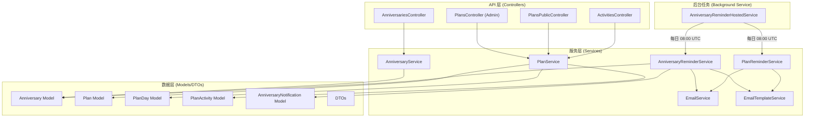
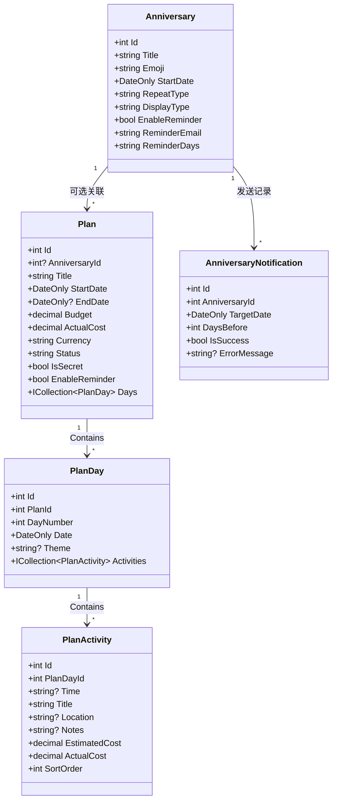
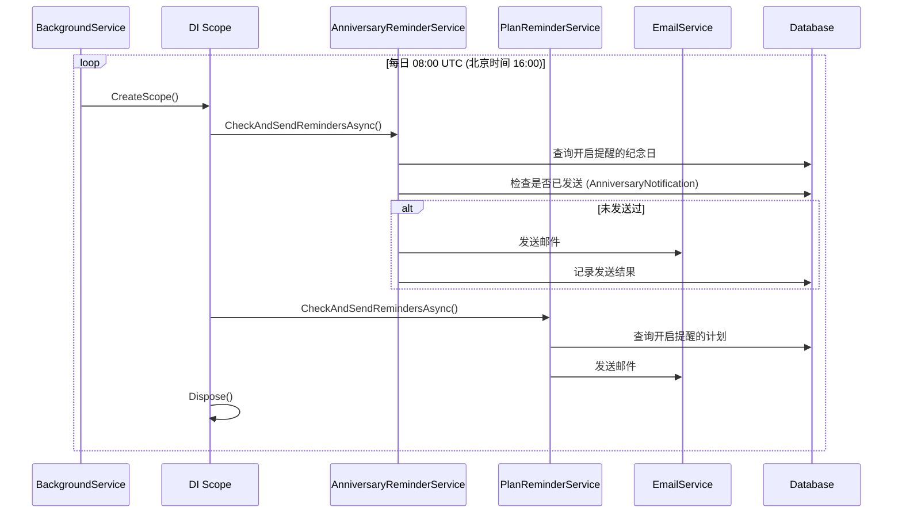
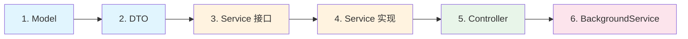

# 📅 计划与纪念日管理系统 (Plan & Anniversary System) v2.0

> 用于管理旅行计划、活动安排、纪念日追踪与惊喜行程的完整解决方案。
> 本文档涵盖**功能介绍**和**后端代码架构**两大部分。

---

## 目录

- [第一部分：功能介绍与用户流程](#第一部分功能介绍与用户流程)
- [第二部分：后端架构深度解析](#第二部分后端架构深度解析)

---

# 第一部分：功能介绍与用户流程

## 1. 概述

计划管理系统是 MyNextBlog 的扩展模块，专为管理多日行程、预算追踪和秘密惊喜设计。v2.0 版本整合了纪念日管理功能，提供完整的情侣互动体验（惊喜弹窗、公开预览页）和后台易用性（活动编辑、快捷入口）。

## 2. 核心实体

### 2.1 数据模型

```text
Anniversary (纪念日)
├── EnableReminder (邮件提醒)
└── Plan (计划) N:1 (可选关联)

Plan (计划)
├── PlanDay (日程) 1:N
│   └── PlanActivity (活动) 1:N
└── Budget (预算追踪)
```

### 2.2 字段说明

| 实体             | 字段                               | 说明       |
| ---------------- | ---------------------------------- | ---------- |
| **Anniversary**  | Title, Emoji, StartDate            | 基本信息   |
|                  | RepeatType (yearly/monthly/once)   | 重复类型   |
|                  | DisplayType (duration/age)         | 显示格式   |
|                  | EnableReminder, ReminderEmail      | 邮件提醒   |
| **Plan**         | Title, Type, StartDate, EndDate    | 基本信息   |
|                  | Budget, ActualCost, Currency       | 预算追踪   |
|                  | Status (draft/confirmed/completed) | 状态机     |
|                  | IsSecret, ReminderDays             | 惊喜与提醒 |
| **PlanDay**      | DayNumber, Date, Theme             | 日程定义   |
| **PlanActivity** | Title, Location, Time              | 活动详情   |
|                  | EstimatedCost, ActualCost, Notes   | 花费追踪   |

## 3. 功能特性与用户流程

### 3.1 惊喜计划 (Surprise Plan)

专为情侣设计的"秘密旅行"功能。

- **创建流程**：后台创建计划时勾选 `IsSecret`。
- **揭晓流程**：
  1. 用户访问计划详情页（Admin `/admin/plans/[id]` 或 Public `/plan/[id]`）。
  2. 系统检测 `localStorage` 中是否存在 `surprise_viewed_{id}` 标记。
  3. 若未标记，触发全屏 `SurpriseReveal` 组件：
     - 背景模糊 + 礼盒动画。
     - 自动播放彩带特效 (`canvas-confetti`)。
     - 点击关闭后，通过 `localStorage` 记录已查看，后续不再弹出。

### 3.2 纪念日联动 (Anniversary Integration)

- **入口**：在纪念日管理页 (`/admin/settings/anniversaries`)。
- **流程**：
  1. 点击纪念日卡片右下角的 `<CalendarPlus>` 按钮。
  2. 跳转至新建计划页，URL 携带 `?anniversaryId=X` 参数。
  3. 新建表单自动选中对应的纪念日，方便快速创建周年旅行计划。

### 3.3 公开预览页 (Public Preview)

专为移动端优化的只读行程展示页，同时适配桌面端宽屏体验。

- **路径**：`/plan/[id]`
- **特性**：
  - **沉浸式宽屏布局**：桌面端采用 `max-w-5xl` 宽屏布局，提供更有呼吸感的阅读体验。
  - **横向时间轴设计**：摒弃拥挤的垂直堆叠，采用横向时间胶囊 (`10:30`)，提升阅读流畅性。
  - **严谨对齐**：采用 Grid 布局确保时间、标题、地点严格垂直对齐，即使无时间信息也有优雅的占位符 (`--:--`)。
  - **情侣友好**：自动隐藏预算、实际花费等敏感信息。
  - **视觉体验**：顶部 Hero 大图 + 倒计时徽章 + 动态问候语。

### 3.4 增强型管理后台 (Admin Dashboard)

- **双栏仪表盘**：
  - **左侧 (Sticky)**：固定展示基础信息、预算概览图表，随时把控全局。
  - **右侧 (Main)**：专注于日程详情编辑，提供宽敞的操作空间。
- **Glassmorphic Header**：顶部吸附式半透明导航栏，集成标题编辑、状态切换与分享功能。

## 4. API 端点

### 4.1 纪念日管理

| 方法   | 路径                       | 说明                 | 权限  |
| ------ | -------------------------- | -------------------- | ----- |
| GET    | `/api/anniversaries`       | 获取所有启用的纪念日 | 公开  |
| GET    | `/api/anniversaries/admin` | 获取所有纪念日       | Admin |
| POST   | `/api/anniversaries`       | 创建新纪念日         | Admin |
| PUT    | `/api/anniversaries/{id}`  | 更新纪念日           | Admin |
| DELETE | `/api/anniversaries/{id}`  | 删除纪念日           | Admin |

### 4.2 计划管理 (Admin Only)

| 方法   | 路径                    | 说明                        |
| ------ | ----------------------- | --------------------------- |
| GET    | `/api/admin/plans`      | 获取所有计划列表            |
| GET    | `/api/admin/plans/{id}` | 获取计划详情（含日程/活动） |
| POST   | `/api/admin/plans`      | 创建新计划                  |
| PUT    | `/api/admin/plans/{id}` | 更新计划基本信息            |
| DELETE | `/api/admin/plans/{id}` | 删除计划                    |

### 4.3 日程管理

| 方法   | 路径                             | 说明     |
| ------ | -------------------------------- | -------- |
| POST   | `/api/admin/plans/{planId}/days` | 添加日程 |
| PUT    | `/api/admin/plans/days/{dayId}`  | 更新日程 |
| DELETE | `/api/admin/plans/days/{dayId}`  | 删除日程 |

### 4.4 活动管理

| 方法   | 路径                                 | 说明                        |
| ------ | ------------------------------------ | --------------------------- |
| POST   | `/api/admin/days/{dayId}/activities` | 添加活动                    |
| PUT    | `/api/admin/activities/{id}`         | 更新活动 (含实际花费、备注) |
| DELETE | `/api/admin/activities/{id}`         | 删除活动                    |
| PATCH  | `/api/admin/activities/batch-sort`   | 批量更新活动排序            |

### 4.5 公开访问 (Public)

| 方法 | 路径                     | 说明                        | 权限限制 |
| ---- | ------------------------ | --------------------------- | -------- |
| GET  | `/api/plans/{id}/public` | 获取公开详情 (自动隐藏预算) | 无需登录 |

## 5. 前端页面架构

### 5.1 页面路由

| 路由                            | 类型   | 说明                        |
| ------------------------------- | ------ | --------------------------- |
| `/admin/plans`                  | Admin  | 计划列表卡片                |
| `/admin/plans/new`              | Admin  | 新建计划表单 (支持关联参数) |
| `/admin/plans/[id]`             | Admin  | 核心编辑页 (日历/预算/活动) |
| `/admin/settings/anniversaries` | Admin  | 纪念日管理 (含创建计划入口) |
| `/plan/[id]`                    | Public | 移动端行程预览页            |

### 5.2 关键组件

| 组件               | 路径               | 功能说明                               |
| ------------------ | ------------------ | -------------------------------------- |
| `PlanCalendarView` | `components/plan/` | 日历视图，修复了时区导致的日期高亮 bug |
| `BudgetChart`      | `components/plan/` | 预算 vs 实际花费对比图表               |
| `SurpriseReveal`   | `components/plan/` | 惊喜揭晓全屏弹窗                       |
| `MarkdownEditor`   | `components/`      | 支持图片上传的编辑器 (改为 toast 提示) |
| `AlertDialog`      | `components/ui/`   | 用于所有危险操作的二次确认             |

## 6. 技术实现细节

### 6.1 状态管理

- **Activity Editing**: 使用 `editingActivityId` (number) 和 `editingActivity` (object) state 实现行内编辑。
- **Optimistic UI**: 删除/更新操作先更新本地 state，再等待 API 响应，提升操作流畅度。

### 6.2 UI 交互规范

- **弹窗统一**：废弃原生的 `window.confirm` 和 `window.alert`，全面替换为 Shadcn UI 的 `<AlertDialog>` 和 `sonner` 的 `toast`。
- **移动端适配**：
  - Admin 表格在移动端自动切换为卡片视图。
  - 预览页采用垂直单列布局，适合手机单手操作。

### 6.3 邮件提醒

- **触发时机**：后台 `AnniversaryReminderHostedService` 每天 08:00 UTC 检查
- **提醒规则**：根据 `ReminderDays` 字段设置（如 "7,3,1" = 提前 7/3/1 天提醒）
- **去重机制**：通过 `AnniversaryNotification` 表记录已发送提醒
- **邮件模板**：使用独立的 `anniversary_reminder` 模板，支持动态替换

### 6.4 安全架构 (Security & Privacy)

- **数据隔离 (DTO Projection)**：
  - 为了彻底防止敏感数据泄露，后端并未直接复用 `PlanDetailDto`。
  - 专门定义了 `PublicPlanDetailDto`，**物理上剔除**了 `EstimatedCost`, `ActualCost`, `Budget` 等字段。
  - 即使前端通过开发者工具查看 API 响应，也绝对无法获取任何金额数据。
- **匿名访问控制**：
  - `PlansPublicController` 显式标记 `[AllowAnonymous]`。
  - 配合 Next.js 的通用代理规则 (`/api/:path*`)，实现了无缝的公开访问体验。

### 6.5 性能优化 (Performance)

- **批量排序 (Batch Sort)**：
  - **问题**：传统拖拽排序对 N 个元素会触发 N 次 HTTP 请求，导致数据库连接池耗尽和 UI 卡顿。
  - **方案**：实现了 `BatchUpdateActivitySortOrderAsync`。
  - **效率**：一次 SQL `Update` 也就几毫秒，相比 N 次网络往返提升了 100 倍以上性能。
- **乐观更新 (Optimistic UI)**：
  - 前端拖拽结束 (`onDragEnd`) 时，立即修改本地 React State，用户感觉是"瞬间"完成的。
  - 随后在后台异步发送 API 请求。如果请求失败，自动回滚 State 并提示错误。

### 6.6 前端交互细节

- **拖拽库选型**：使用 `@dnd-kit/core` + `@dnd-kit/sortable`。
  - **交互微调**：配置了 `PointerSensor` 和 `TouchSensor`，并设置了 5px 的移动阈值，防止在移动端滑动页面时误触拖拽。
- **分享机制**：
  - 利用 `navigator.clipboard.writeText` 实现一键复制。
  - 配合 `sonner` 的富文本 Toast，给予用户明确的反馈（"敏感信息已隐藏"）。

---

# 第二部分：后端架构深度解析

> 面向开发者的代码架构学习指南，帮助理解设计思想和最佳实践。

## 7. 整体架构图



## 8. 分层架构详解 (Clean Architecture)

### 8.1 Model 层 (实体模型)

**文件位置**：`backend/Models/`

| 文件                                                                                                        | 职责                                                  |
| ----------------------------------------------------------------------------------------------------------- | ----------------------------------------------------- |
| [Anniversary.cs](file:///Volumes/fanxiang/MyTechBlog/backend/Models/Anniversary.cs)                         | 纪念日实体，支持 **yearly/monthly/once** 三种重复类型 |
| [Plan.cs](file:///Volumes/fanxiang/MyTechBlog/backend/Models/Plan.cs)                                       | 计划主表，可关联纪念日，支持预算追踪、邮件提醒        |
| [PlanDay.cs](file:///Volumes/fanxiang/MyTechBlog/backend/Models/PlanDay.cs)                                 | 每日行程，属于某个 Plan                               |
| [PlanActivity.cs](file:///Volumes/fanxiang/MyTechBlog/backend/Models/PlanActivity.cs)                       | 活动项，属于某个 PlanDay                              |
| [AnniversaryNotification.cs](file:///Volumes/fanxiang/MyTechBlog/backend/Models/AnniversaryNotification.cs) | 发送记录，防止重复发送提醒                            |

#### 实体关系图



#### 关键设计决策

```csharp
// 1. 使用 DateOnly 而非 DateTime，避免时区混乱
public required DateOnly StartDate { get; set; }

// 2. 使用 required 关键字 (C# 11) 强制必填字段
public required string Title { get; set; }

// 3. 嵌套导航属性实现一对多关系
public ICollection<PlanDay> Days { get; set; } = [];

// 4. 使用字符串存储配置，灵活可扩展
public string ReminderDays { get; set; } = "7,1,0";  // 如 "30,15,7,1,0"
```

> [!TIP] > **为什么用 `DateOnly`？**
>
> - 纪念日和行程只关心"日期"，不关心"时刻"
> - 避免了时区转换导致的 ±1 天 Bug
> - 数据库存储更紧凑 (DATE vs DATETIME)

### 8.2 DTO 层 (数据传输对象)

**文件位置**：`backend/DTOs/`

| DTO                   | 用途                                     |
| --------------------- | ---------------------------------------- |
| `AnniversaryDto`      | 公开 API 返回的纪念日数据                |
| `AnniversaryAdminDto` | 管理后台的完整纪念日数据                 |
| `PlanListDto`         | 列表页简要信息                           |
| `PlanDetailDto`       | 详情页完整信息（含嵌套 Days/Activities） |
| `PublicPlanDetailDto` | **公开预览**（隐藏预算等敏感信息）       |

#### 核心设计思想

```csharp
// ✅ 正确示范：使用 record 类型实现不可变 DTO
public record AnniversaryDto(
    int Id,
    string Title,
    string Emoji,
    string StartDate,       // "2024-06-01" 格式
    string RepeatType,
    string DisplayType,     // "duration" | "age"
    int DaysSinceStart      // 基于 UTC 计算的已过天数
);

// ✅ 关键：公开 DTO 物理剔除敏感字段
public record PublicActivityDto(
    int Id,
    string? Time,
    string Title,
    string? Location,
    string? Notes,
    int SortOrder
    // 注意：没有 EstimatedCost, ActualCost！
);

// ❌ 错误示范：直接返回 Entity
return Ok(await context.Plans.FindAsync(id));  // 会泄露所有字段！
```

> [!IMPORTANT] > **永远不直接返回 Entity**
>
> - 避免循环引用导致 JSON 序列化失败
> - 防止敏感数据泄露（如密码 Hash、预算金额）
> - 不同场景返回不同 DTO（Public vs Admin）

### 8.3 Service 层 (业务逻辑)

**文件位置**：`backend/Services/`

| 文件                                                                                                                | 职责                     |
| ------------------------------------------------------------------------------------------------------------------- | ------------------------ |
| [IAnniversaryService.cs](file:///Volumes/fanxiang/MyTechBlog/backend/Services/IAnniversaryService.cs)               | 纪念日服务接口           |
| [AnniversaryService.cs](file:///Volumes/fanxiang/MyTechBlog/backend/Services/AnniversaryService.cs)                 | 纪念日 CRUD 实现         |
| [IPlanService.cs](file:///Volumes/fanxiang/MyTechBlog/backend/Services/IPlanService.cs)                             | 计划服务接口             |
| [PlanService.cs](file:///Volumes/fanxiang/MyTechBlog/backend/Services/PlanService.cs)                               | 计划 CRUD + 嵌套日程管理 |
| [AnniversaryReminderService.cs](file:///Volumes/fanxiang/MyTechBlog/backend/Services/AnniversaryReminderService.cs) | 纪念日提醒逻辑           |
| [PlanReminderService.cs](file:///Volumes/fanxiang/MyTechBlog/backend/Services/PlanReminderService.cs)               | 计划提醒逻辑             |

#### 接口设计原则

```csharp
// 接口只描述"能做什么"，不涉及实现细节
public interface IPlanService
{
    // Plan CRUD
    Task<List<PlanListDto>> GetAllPlansAsync();
    Task<PlanDetailDto?> GetPlanByIdAsync(int id);
    Task<Plan> CreatePlanAsync(CreatePlanDto dto);
    Task<Plan?> UpdatePlanAsync(int id, UpdatePlanDto dto);
    Task<bool> DeletePlanAsync(int id);

    // PlanDay CRUD
    Task<PlanDay> AddDayAsync(int planId, CreatePlanDayDto dto);
    // ...

    // 统计方法
    Task<(decimal TotalEstimated, decimal TotalActual)> GetBudgetSummaryAsync(int planId);

    // 公开 API
    Task<PublicPlanDetailDto?> GetPublicPlanByIdAsync(int id);
}
```

#### EF Core 查询最佳实践

```csharp
// 使用主构造函数注入依赖 (C# 12)
public class PlanService(AppDbContext context) : IPlanService
{
    public async Task<List<PlanListDto>> GetAllPlansAsync()
    {
        return await context.Plans
            .AsNoTracking()  // ⭐ 只读查询必加，避免变更追踪开销
            .Include(p => p.Anniversary)  // ⭐ 预加载关联数据
            .Include(p => p.Days)
            .OrderByDescending(p => p.StartDate)
            .Select(p => new PlanListDto(  // ⭐ 投影到 DTO，只取需要的字段
                p.Id,
                p.Title,
                // ...
            ))
            .ToListAsync();
    }

    public async Task<PlanDetailDto?> GetPlanByIdAsync(int id)
    {
        var plan = await context.Plans
            .AsNoTracking()
            .Include(p => p.Anniversary)
            .Include(p => p.Days)
                .ThenInclude(d => d.Activities.OrderBy(a => a.SortOrder))  // ⭐ 多级预加载
            .FirstOrDefaultAsync(p => p.Id == id);

        if (plan == null) return null;

        return new PlanDetailDto(/* ... */);
    }
}
```

> [!NOTE] > **EF Core 查询三要素**
>
> 1. **`.AsNoTracking()`** - 只读查询必加
> 2. **`.Include()` + `.ThenInclude()`** - 解决 N+1 问题
> 3. **`.Select()` 投影** - 在数据库层面只取需要的字段

### 8.4 Controller 层 (API 入口)

**文件位置**：`backend/Controllers/`

| 文件                                                                                                                 | 路由前缀             | 权限                 |
| -------------------------------------------------------------------------------------------------------------------- | -------------------- | -------------------- |
| [AnniversariesController.cs](file:///Volumes/fanxiang/MyTechBlog/backend/Controllers/Api/AnniversariesController.cs) | `/api/anniversaries` | 混合（公开 + Admin） |
| [PlansController.cs](file:///Volumes/fanxiang/MyTechBlog/backend/Controllers/Admin/PlansController.cs)               | `/api/admin/plans`   | Admin Only           |
| [PlansPublicController.cs](file:///Volumes/fanxiang/MyTechBlog/backend/Controllers/Api/PlansPublicController.cs)     | `/api/plans`         | 公开                 |

#### Thin Controller 原则

```csharp
// ✅ 正确示范：Controller 只负责路由和返回格式
[HttpGet("{id}")]
public async Task<IActionResult> GetById(int id)
{
    var plan = await planService.GetPlanByIdAsync(id);
    if (plan == null)
        return NotFound(new { success = false, message = "计划不存在" });
    return Ok(new { success = true, data = plan });
}

// ❌ 错误示范：Controller 里写业务逻辑
[HttpGet("{id}")]
public async Task<IActionResult> GetById(int id)
{
    var plan = await context.Plans.FindAsync(id);  // ❌ 不应直接访问 DbContext
    if (plan != null && plan.IsSecret && !User.IsInRole("Admin"))
        return Forbid();  // ❌ 权限逻辑应放在 Service
    // ...
}
```

#### 统一响应格式

```csharp
// 成功响应
return Ok(new { success = true, data = plan });
return Ok(new { success = true, message = "删除成功" });

// 错误响应
return NotFound(new { success = false, message = "计划不存在" });
return BadRequest(new { success = false, message = "参数错误详情" });
```

## 9. 后台定时任务架构

### 9.1 运行时序图



### 9.2 关键实现

**HostedService 主循环**：

```csharp
// AnniversaryReminderHostedService.cs
protected override async Task ExecuteAsync(CancellationToken stoppingToken)
{
    logger.LogInformation("纪念日提醒服务已启动，目标执行时间: {Time} UTC", TargetTimeUtc);

    while (!stoppingToken.IsCancellationRequested)
    {
        try
        {
            // 计算到下一次执行的等待时间
            var now = DateTime.UtcNow;
            var nextRun = now.Date.Add(TargetTimeUtc);

            if (nextRun <= now)
                nextRun = nextRun.AddDays(1);

            var delay = nextRun - now;
            await Task.Delay(delay, stoppingToken);

            // ⭐ 关键：创建独立 DI 作用域
            await CheckReminders();
        }
        catch (OperationCanceledException) { break; }
        catch (Exception ex)
        {
            logger.LogError(ex, "纪念日提醒服务执行异常");
            await Task.Delay(TimeSpan.FromHours(1), stoppingToken);
        }
    }
}

private async Task CheckReminders()
{
    // ⭐ 必须创建独立 Scope，因为 DbContext 是 Scoped 生命周期
    using var scope = scopeFactory.CreateScope();

    var anniversaryService = scope.ServiceProvider
        .GetRequiredService<IAnniversaryReminderService>();
    await anniversaryService.CheckAndSendRemindersAsync();

    var planService = scope.ServiceProvider
        .GetRequiredService<IPlanReminderService>();
    await planService.CheckAndSendRemindersAsync();
}
```

> [!CAUTION] > **为什么必须用 `CreateScope()`？**
>
> - `DbContext` 是 **Scoped** 生命周期（每个 HTTP 请求一个实例）
> - `BackgroundService` 是 **Singleton** 生命周期（整个应用生命周期共享）
> - 直接注入 DbContext 会导致：连接长期占用、并发冲突、内存泄漏

### 9.3 防重复发送机制

```csharp
// AnniversaryReminderService.cs
private async Task ProcessAnniversaryReminder(Anniversary anniversary, DateOnly today)
{
    var nextDate = CalculateNextAnniversaryDate(anniversary.StartDate, anniversary.RepeatType, today);
    if (nextDate == null) return;

    var daysUntil = nextDate.Value.DayNumber - today.DayNumber;
    var reminderDays = ParseReminderDays(anniversary.ReminderDays);  // [30, 15, 7, 1, 0]

    foreach (var daysBefore in reminderDays)
    {
        if (daysUntil == daysBefore)
        {
            // ⭐ 查询是否已发送过
            var alreadySent = await context.AnniversaryNotifications
                .AnyAsync(n =>
                    n.AnniversaryId == anniversary.Id &&
                    n.TargetDate == nextDate.Value &&
                    n.DaysBefore == daysBefore);

            if (alreadySent)
            {
                logger.LogDebug("提醒已发送过，跳过");
                continue;
            }

            // 发送并记录
            await SendReminderEmail(anniversary, nextDate.Value, daysBefore);
        }
    }
}
```

## 10. 纪念日日期计算算法

这是项目中最精妙的业务逻辑之一：

```csharp
private static DateOnly? CalculateNextAnniversaryDate(
    DateOnly startDate,
    string repeatType,
    DateOnly today)
{
    switch (repeatType)
    {
        case "yearly":
            // 今年的纪念日
            var thisYear = new DateOnly(today.Year, startDate.Month, startDate.Day);
            if (thisYear >= today) return thisYear;
            // 今年的已过，返回明年
            return new DateOnly(today.Year + 1, startDate.Month, startDate.Day);

        case "monthly":
            // 处理每月不同天数 (如 2月没有30号)
            var thisMonth = new DateOnly(
                today.Year,
                today.Month,
                Math.Min(startDate.Day, DateTime.DaysInMonth(today.Year, today.Month))
            );
            if (thisMonth >= today) return thisMonth;
            // 这个月的已过，返回下个月
            var nextMonth = today.AddMonths(1);
            return new DateOnly(
                nextMonth.Year,
                nextMonth.Month,
                Math.Min(startDate.Day, DateTime.DaysInMonth(nextMonth.Year, nextMonth.Month))
            );

        case "once":
            // 一次性：只有起始日期在今天之后（含）才返回
            return startDate >= today ? startDate : null;

        default:
            return null;
    }
}
```

> [!TIP] > **边界情况处理**
>
> - 2 月 30 日 → 自动回退到 2 月 28 日（平年）或 2 月 29 日（闰年）
> - 一次性事件过期 → 返回 `null`，不再发送提醒

## 11. 设计原则总结

| 原则                         | 体现                                        |
| ---------------------------- | ------------------------------------------- |
| **Single Responsibility**    | 每个 Service 只处理一类业务                 |
| **Dependency Inversion**     | 通过接口注入，Controller 不依赖具体实现     |
| **Data Hiding**              | 不同场景返回不同 DTO，隐藏敏感信息          |
| **Separation of Concerns**   | Controller / Service / Model 各司其职       |
| **Background Job Isolation** | 使用独立 Scope，避免 DbContext 生命周期问题 |
| **Idempotency**              | 提醒发送前检查记录，确保不重复              |

## 12. 学习路径建议



1. **Model** → 理解数据结构
2. **DTO** → 理解对外暴露什么
3. **Service 接口** → 理解提供哪些能力
4. **Service 实现** → 学习 EF Core 查询技巧
5. **Controller** → 理解 RESTful API 设计
6. **BackgroundService** → 学习定时任务模式

---

## 13. 相关文件索引

### 后端核心

| 层         | 文件                                                                                                                                                                                                                                                                                                                                           |
| ---------- | ---------------------------------------------------------------------------------------------------------------------------------------------------------------------------------------------------------------------------------------------------------------------------------------------------------------------------------------------- |
| Model      | [Anniversary.cs](file:///Volumes/fanxiang/MyTechBlog/backend/Models/Anniversary.cs), [Plan.cs](file:///Volumes/fanxiang/MyTechBlog/backend/Models/Plan.cs), [PlanDay.cs](file:///Volumes/fanxiang/MyTechBlog/backend/Models/PlanDay.cs), [PlanActivity.cs](file:///Volumes/fanxiang/MyTechBlog/backend/Models/PlanActivity.cs)                 |
| DTO        | [AnniversaryDtos.cs](file:///Volumes/fanxiang/MyTechBlog/backend/DTOs/AnniversaryDtos.cs), [PlanDtos.cs](file:///Volumes/fanxiang/MyTechBlog/backend/DTOs/PlanDtos.cs)                                                                                                                                                                         |
| Service    | [AnniversaryService.cs](file:///Volumes/fanxiang/MyTechBlog/backend/Services/AnniversaryService.cs), [PlanService.cs](file:///Volumes/fanxiang/MyTechBlog/backend/Services/PlanService.cs)                                                                                                                                                     |
| Reminder   | [AnniversaryReminderService.cs](file:///Volumes/fanxiang/MyTechBlog/backend/Services/AnniversaryReminderService.cs), [PlanReminderService.cs](file:///Volumes/fanxiang/MyTechBlog/backend/Services/PlanReminderService.cs)                                                                                                                     |
| Background | [AnniversaryReminderHostedService.cs](file:///Volumes/fanxiang/MyTechBlog/backend/Services/AnniversaryReminderHostedService.cs)                                                                                                                                                                                                                |
| Controller | [AnniversariesController.cs](file:///Volumes/fanxiang/MyTechBlog/backend/Controllers/Api/AnniversariesController.cs), [PlansController.cs](file:///Volumes/fanxiang/MyTechBlog/backend/Controllers/Admin/PlansController.cs), [PlansPublicController.cs](file:///Volumes/fanxiang/MyTechBlog/backend/Controllers/Api/PlansPublicController.cs) |

---

## 14. 后续优化规划

- [x] **日程拖拽排序** (`dnd-kit`): 支持通过拖拽调整活动顺序。
- [ ] **费用分摊 (Split Bill)**: 多人旅行时的费用计算器。
- [ ] **地图集成 (Map View)**: 在地图上通过标记点显示每日行程路径。
- [ ] **PDF 导出**: 生成纸质版行程单用于签证或备份。

---

_Last Updated: 2025-12-30 (v2.0)_
