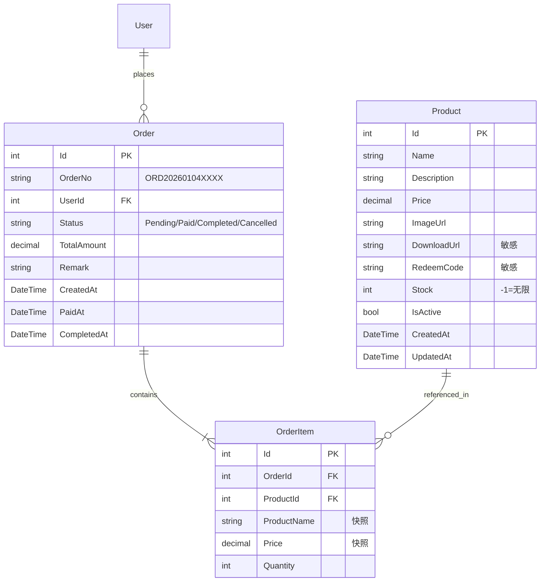
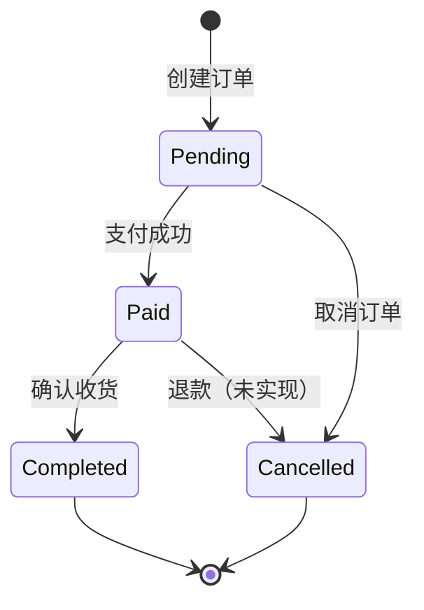

# 购物功能模块架构文档 (Shopping Feature Architecture)

> **最后更新**: 2026-01-04

## 1. 功能概述

购物功能是一个完整的电商子系统，支持商品展示、购物车、订单管理和模拟支付流程。特别设计用于**虚拟商品（电子书、下载链接、兑换码）**的销售。

### 核心特性

| 特性             | 描述                                               |
| ---------------- | -------------------------------------------------- |
| **商品管理**     | 支持上架/下架、库存管理、无限库存虚拟商品          |
| **购物车**       | 基于 localStorage 的客户端购物车                   |
| **订单系统**     | 后端价格查询、原子库存扣减、事务一致性             |
| **支付网关**     | 策略模式设计，当前使用模拟支付，可扩展接入真实支付 |
| **自动发货**     | 支付成功后自动发送下载链接/兑换码邮件              |
| **敏感信息保护** | 下载链接和兑换码仅在付款后显示                     |

---

## 2. 数据模型

### 2.1 实体关系图



### 2.2 订单状态机



---

## 3. 后端架构

### 3.1 服务层

| 服务                         | 接口                        | 职责                                     |
| ---------------------------- | --------------------------- | ---------------------------------------- |
| **ProductService**           | `IProductService`           | 商品 CRUD、库存管理、公开/管理员视图分离 |
| **OrderService**             | `IOrderService`             | 订单创建、支付处理、库存扣减、取消恢复   |
| **OrderNotificationService** | `IOrderNotificationService` | 订单创建/完成邮件通知                    |
| **MockPaymentGateway**       | `IPaymentGateway`           | 模拟支付网关（策略模式）                 |

### 3.2 API 端点

#### 公开 API（用户）

| 方法   | 路由                       | 功能               |
| ------ | -------------------------- | ------------------ |
| `GET`  | `/api/products`            | 获取上架商品列表   |
| `GET`  | `/api/products/{id}`       | 获取商品详情       |
| `POST` | `/api/orders`              | 创建订单 [JWT]     |
| `GET`  | `/api/orders`              | 获取我的订单 [JWT] |
| `GET`  | `/api/orders/{id}`         | 获取订单详情 [JWT] |
| `POST` | `/api/orders/{id}/pay`     | 模拟付款 [JWT]     |
| `POST` | `/api/orders/{id}/confirm` | 确认收货 [JWT]     |

#### 管理 API（Admin）

| 方法     | 路由                            | 功能                       |
| -------- | ------------------------------- | -------------------------- |
| `GET`    | `/api/admin/products`           | 获取所有商品（含下架）     |
| `GET`    | `/api/admin/products/{id}`      | 获取商品详情（含敏感信息） |
| `POST`   | `/api/admin/products`           | 创建商品                   |
| `PUT`    | `/api/admin/products/{id}`      | 更新商品                   |
| `DELETE` | `/api/admin/products/{id}`      | 删除商品                   |
| `GET`    | `/api/admin/orders`             | 获取所有订单               |
| `POST`   | `/api/admin/orders/{id}/cancel` | 取消订单（恢复库存）       |

### 3.3 核心业务逻辑

#### 原子库存扣减

```csharp
// OrderService.CreateOrderAsync
// 使用 ExecuteUpdate 实现数据库级别的原子操作
var affected = await _context.Products
    .Where(p => p.Id == item.ProductId && p.Stock >= item.Quantity)
    .ExecuteUpdateAsync(s => s.SetProperty(
        p => p.Stock,
        p => p.Stock - item.Quantity
    ));

if (affected == 0)
    throw new InvalidOperationException("库存不足（并发冲突）");
```

#### 事务一致性

```csharp
// 订单创建使用数据库事务
await using var transaction = await _context.Database.BeginTransactionAsync();
try
{
    // 1. 创建订单
    // 2. 扣减库存
    // 3. 提交事务
    await transaction.CommitAsync();
}
catch
{
    await transaction.RollbackAsync();
    throw;
}
```

#### 敏感信息保护

```csharp
// DTO 映射时根据订单状态决定是否显示敏感信息
private OrderDto MapToDto(Order order, bool showSensitiveInfo)
{
    return new OrderDto(
        // ...
        Items: order.Items.Select(oi => new OrderItemDto(
            // ...
            DownloadUrl: showSensitiveInfo ? oi.Product.DownloadUrl : null,
            RedeemCode: showSensitiveInfo ? oi.Product.RedeemCode : null
        )).ToList()
    );
}
```

---

## 4. 前端架构

### 4.1 页面结构

| 路由              | 页面     | 功能                     |
| ----------------- | -------- | ------------------------ |
| `/shop`           | 商品列表 | 展示上架商品网格         |
| `/shop/[id]`      | 商品详情 | 商品信息、加入购物车     |
| `/cart`           | 购物车   | 管理购物车、结算入口     |
| `/checkout`       | 确认订单 | 登录检查、提交订单       |
| `/orders`         | 我的订单 | 订单列表                 |
| `/orders/[id]`    | 订单详情 | 付款、确认收货、下载链接 |
| `/admin/products` | 商品管理 | CRUD 操作                |
| `/admin/orders`   | 订单管理 | 查看/取消订单            |

### 4.2 购物车设计

```typescript
// 购物车使用 localStorage 存储
interface CartItem {
  productId: number;
  name: string;
  price: number;
  quantity: number;
  imageUrl: string | null;
}

// 购物车操作
function addToCart(item: CartItem) {
  const cart = JSON.parse(localStorage.getItem("cart") || "[]");
  // 合并或添加商品
  localStorage.setItem("cart", JSON.stringify(updatedCart));
}
```

---

## 5. 邮件通知

### 5.1 邮件模板

| 模板 Key          | 触发场景   | 占位符                                            |
| ----------------- | ---------- | ------------------------------------------------- |
| `order_created`   | 订单创建时 | `{{OrderNo}}`, `{{TotalAmount}}`, `{{UserEmail}}` |
| `order_completed` | 支付成功后 | `{{OrderNo}}`, `{{Items}}` (含下载链接)           |

### 5.2 发货邮件格式

```html
<p>您购买的商品信息如下：</p>
<ul>
  <li>
    <strong>电子书 A</strong> x 1 - ¥29.99
    <ul>
      <li>下载链接: <a href="...">点击下载</a></li>
      <li>兑换码: EBOOK-A-123</li>
    </ul>
  </li>
</ul>
```

---

## 6. 单元测试

### 6.1 测试覆盖

| 测试类                | 测试数量 | 覆盖内容                   |
| --------------------- | -------- | -------------------------- |
| `ProductServiceTests` | 14       | 公开 API、管理员 API、CRUD |
| `OrderServiceTests`   | 18       | 创建、库存扣减、支付、取消 |

### 6.2 测试策略

- **数据库**: SQLite 内存模式（支持事务和 ExecuteUpdate）
- **隔离**: 每个测试使用独立数据库连接
- **Mock**: 支付网关和通知服务使用 Moq 模拟

---

## 7. 安全考量

| 风险             | 缓解措施                                        |
| ---------------- | ----------------------------------------------- |
| **价格篡改**     | 后端重新查询商品价格，不信任前端传入价格        |
| **库存超卖**     | 使用 ExecuteUpdate 原子操作 + 事务              |
| **敏感信息泄露** | DTO 层面条件过滤 DownloadUrl/RedeemCode         |
| **未授权访问**   | 所有用户 API 需要 JWT，管理 API 需要 Admin 角色 |

---

## 8. 扩展路线图

- [ ] **真实支付集成**: 实现 `StripePaymentGateway` 或 `AlipayPaymentGateway`
- [ ] **库存预警**: 库存低于阈值时发送管理员通知
- [ ] **订单超时**: 未支付订单自动取消并恢复库存
- [ ] **优惠券系统**: 支持折扣码和促销活动
- [ ] **数字签名**: 下载链接添加时效性签名防盗链
