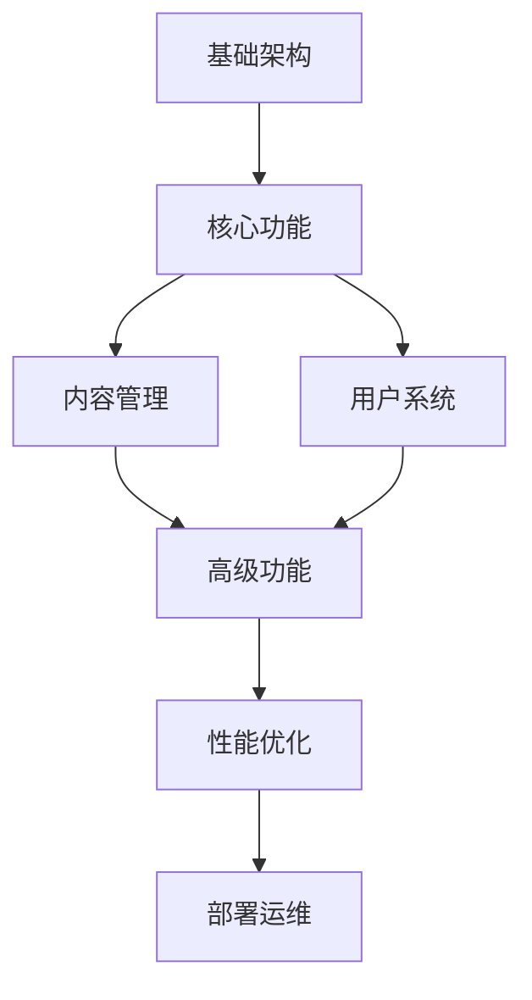
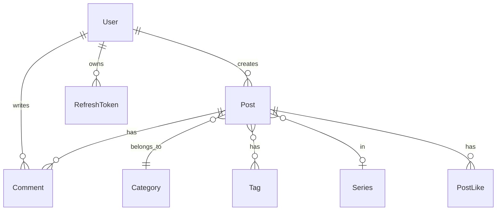

# MyNextBlog 项目学习路线图

> **目标**：从零开始系统性地学习项目的每个模块，深入理解前后端架构和设计思想

---

## 📚 学习路径概览



---

## 🏗️ 阶段一：基础架构理解（1-2 天）

### 1.1 项目结构与技术栈

**目标**：了解项目的整体结构和技术选型

📁 **关键文件**：

- [docker-compose.yml](file:///Volumes/fanxiang/MyTechBlog/docker-compose.yml) - 容器编排
- [backend/MyNextBlog.csproj](file:///Volumes/fanxiang/MyTechBlog/backend/MyNextBlog.csproj) - 后端依赖
- [frontend/package.json](file:///Volumes/fanxiang/MyTechBlog/frontend/package.json) - 前端依赖

**学习内容**：

- ✅ **后端**：.NET 10 + EF Core + PostgreSQL
- ✅ **前端**：Next.js 16 (App Router) + TypeScript + Tailwind v4
- ✅ **架构**：BFF (Backend for Frontend) 模式
- ✅ **部署**：Docker + Docker Compose

**动手实践**：

1. 阅读 `docker-compose.yml`，理解三个服务（db、backend、frontend）的配置
2. 启动项目：`docker compose up -d`
3. 访问各个端点验证服务运行

---

### 1.2 数据库设计

**目标**：理解数据模型和实体关系

📁 **关键文件**：

- [backend/Models/](file:///Volumes/fanxiang/MyTechBlog/backend/Models/) - 所有实体模型
- [backend/Data/AppDbContext.cs](file:///Volumes/fanxiang/MyTechBlog/backend/Data/AppDbContext.cs) - EF Core 配置
- [backend/Migrations/](file:///Volumes/fanxiang/MyTechBlog/backend/Migrations/) - 数据库迁移历史

**核心实体关系图**：



**学习顺序**：

1. **User** - 用户系统基础
2. **RefreshToken** - 多设备登录支持
3. **Post** - 文章核心实体
4. **Category/Tag** - 分类和标签
5. **Series** - 系列功能
6. **Comment** - 评论系统
7. **PostLike** - 点赞功能
8. **SiteContent** - 配置系统

**动手实践**：

- 使用数据库工具查看 SQLite 数据库结构
- 阅读 EF Core 的实体配置（`OnModelCreating`）
- 理解软删除（`IsDeleted`）和隐藏（`IsHidden`）的区别

---

## 🔐 阶段二：用户认证系统（2-3 天）

### 2.1 JWT 认证机制

**目标**：理解 JWT 生成、验证和刷新流程

📁 **核心文件**：

- [backend/Services/AuthService.cs](file:///Volumes/fanxiang/MyTechBlog/backend/Services/AuthService.cs) - 认证核心逻辑
- [backend/Controllers/Api/AuthController.cs](file:///Volumes/fanxiang/MyTechBlog/backend/Controllers/Api/AuthController.cs) - 认证 API
- [backend/Program.cs](file:///Volumes/fanxiang/MyTechBlog/backend/Program.cs) - JWT 配置
- [frontend/context/AuthContext.tsx](file:///Volumes/fanxiang/MyTechBlog/frontend/context/AuthContext.tsx) - 前端认证状态

**关键概念**：

```
AccessToken (短期, 15分钟)  ←→  RefreshToken (长期, 7天)
         ↓                              ↓
    存储在 HttpOnly Cookie        存储在 HttpOnly Cookie
         ↓                              ↓
    用于API调用认证            用于刷新AccessToken
```

**学习路径**：

1. **注册流程** (`RegisterAsync`)
   - 密码哈希（BCrypt）
   - 自动生成 RefreshToken
2. **登录流程** (`LoginAsync`)

   - 密码验证
   - JWT 生成
   - RefreshToken 生成和存储

3. **Token 刷新** (`RefreshTokenAsync`)

   - 验证 RefreshToken
   - Token 轮换（3 天内自动刷新）
   - 防止并发冲突

4. **多设备支持**
   - 一个用户多个 RefreshToken
   - DeviceInfo 字段（可扩展）

**动手实践**：

- 使用 Postman 测试注册/登录 API
- 分析 JWT payload 内容（使用 jwt.io）
- 模拟多设备登录场景

---

### 2.2 前端认证流程

**目标**：理解 React Context + Cookie 的认证方案

📁 **核心文件**：

- [frontend/context/AuthContext.tsx](file:///Volumes/fanxiang/MyTechBlog/frontend/context/AuthContext.tsx)
- [frontend/middleware.ts](file:///Volumes/fanxiang/MyTechBlog/frontend/middleware.ts)
- [frontend/app/(auth)/](<file:///Volumes/fanxiang/MyTechBlog/frontend/app/(auth)/>) - 认证页面

**学习要点**：

- ✅ **AuthContext**：全局认证状态管理
- ✅ **Middleware**：路由保护和重定向
- ✅ **Cookie 管理**：HttpOnly Cookie 策略
- ✅ **自动刷新**：Token 过期前自动续期

---

## 📝 阶段三：内容管理系统（3-4 天）

### 3.1 文章 CRUD

**目标**：掌握文章的创建、读取、更新、删除全流程

📁 **后端核心**：

- [backend/Services/PostService.cs](file:///Volumes/fanxiang/MyTechBlog/backend/Services/PostService.cs)
- [backend/Controllers/Api/PostsApiController.cs](file:///Volumes/fanxiang/MyTechBlog/backend/Controllers/Api/PostsApiController.cs)
- [backend/Controllers/Admin/PostsAdminController.cs](file:///Volumes/fanxiang/MyTechBlog/backend/Controllers/Admin/PostsAdminController.cs)

📁 **前端核心**：

- [frontend/app/(admin)/admin/posts/](<file:///Volumes/fanxiang/MyTechBlog/frontend/app/(admin)/admin/posts/>)
- [frontend/app/(public)/posts/](<file:///Volumes/fanxiang/MyTechBlog/frontend/app/(public)/posts/>)

**API 设计分析**：
| 端点 | 用途 | 权限 | 特性 |
|------|------|------|------|
| `GET /api/posts` | 公开文章列表 | 游客 | 缓存、分页、搜索 |
| `GET /api/posts/:id` | 文章详情 | 游客 | 自动隐藏草稿 |
| `GET /api/posts/admin` | 管理文章列表 | Admin | 包含草稿 |
| `POST /api/posts` | 创建文章 | Admin | Markdown 支持 |
| `PUT /api/posts/:id` | 更新文章 | Admin | - |
| `DELETE /api/posts/:id` | 软删除 | Admin | IsDeleted=true |

**学习要点**：

1. **DTO 模式**：`CreatePostDto`, `UpdatePostDto`, `PostSummaryDto`, `PostDetailDto`
2. **缓存策略**：MemoryCache + 10 分钟过期
3. **图片提取**：Markdown 中的封面图提取
4. **软删除 vs 隐藏**：
   - `IsDeleted=true` → 回收站
   - `IsHidden=true` → 草稿

---

### 3.2 Markdown 编辑器

**目标**：理解富文本编辑和预览

📁 **核心文件**：

- [frontend/app/(admin)/admin/posts/new/page.tsx](<file:///Volumes/fanxiang/MyTechBlog/frontend/app/(admin)/admin/posts/new/page.tsx>)
- [frontend/components/MarkdownEditor.tsx](file:///Volumes/fanxiang/MyTechBlog/frontend/components/MarkdownEditor.tsx) (如果有)

**功能特性**：

- 实时预览
- 语法高亮
- 图片上传（Cloudflare R2）
- 代码块支持

---

### 3.3 分类、标签、系列

**目标**：理解内容组织方式

📁 **核心文件**：

- [backend/Services/CategoryService.cs](file:///Volumes/fanxiang/MyTechBlog/backend/Services/CategoryService.cs)
- [backend/Services/TagService.cs](file:///Volumes/fanxiang/MyTechBlog/backend/Services/TagService.cs)
- [backend/Models/Series.cs](file:///Volumes/fanxiang/MyTechBlog/backend/Models/Series.cs)

**关系分析**：

- **Category（分类）**：一篇文章属于一个分类（一对多）
- **Tag（标签）**：一篇文章可以有多个标签（多对多）
- **Series（系列）**：连载文章，有序号排列

**系列功能亮点**：

- 自动计算可见序号（跳过隐藏文章）
- 上一篇/下一篇导航
- 系列进度显示

---

## 🎨 阶段四：前端 UI 架构（2-3 天）

### 4.1 Next.js App Router

**目标**：理解文件系统路由和服务端组件

📁 **核心目录**：

- [frontend/app/(public)/](<file:///Volumes/fanxiang/MyTechBlog/frontend/app/(public)/>) - 公开页面
- [frontend/app/(admin)/](<file:///Volumes/fanxiang/MyTechBlog/frontend/app/(admin)/>) - 管理后台
- [frontend/app/(auth)/](<file:///Volumes/fanxiang/MyTechBlog/frontend/app/(auth)/>) - 认证页面

**路由组（Route Groups）**：

```
app/
├── (public)/          # 公开页面布局
│   ├── layout.tsx     # 公开布局（导航栏、页脚）
│   ├── page.tsx       # 首页
│   ├── posts/         # 文章页面
│   └── about/         # 关于页面
├── (admin)/           # 管理后台布局
│   └── admin/
│       ├── layout.tsx # 管理布局（侧边栏）
│       └── page.tsx   # Dashboard
└── (auth)/            # 认证页面（无导航栏）
    ├── login/
    └── register/
```

**Server vs Client Components**：

- **Server（默认）**：数据获取、SEO 优化
- **Client（'use client'）**：交互、状态管理

---

### 4.2 shadcn/ui 组件库

**目标**：掌握 UI 组件使用

📁 **组件目录**：

- [frontend/components/ui/](file:///Volumes/fanxiang/MyTechBlog/frontend/components/ui/)

**常用组件**：

- `Button`, `Card`, `Input`, `Dialog`
- `Dropdown`, `Toast`, `Badge`

---

### 4.3 Tailwind CSS v4

**目标**：理解原子化 CSS

**设计系统**：

- **配色**：橙色主题（猫咪元素）
- **深色模式**：`dark:` 前缀
- **响应式**：`md:`, `lg:` 断点

---

## 🚀 阶段五：高级功能（3-4 天）

### 5.1 评论系统

📁 **核心文件**：

- [backend/Services/CommentService.cs](file:///Volumes/fanxiang/MyTechBlog/backend/Services/CommentService.cs)
- [frontend/app/(public)/posts/[id]/\_components/CommentsSection.tsx](<file:///Volumes/fanxiang/MyTechBlog/frontend/app/(public)/posts/%5Bid%5D/_components/CommentsSection.tsx>)

**功能分析**：

- 嵌套评论（父子关系）
- 实时更新
- Markdown 支持
- 高亮选文评论（XPath 定位）

---

### 5.2 点赞系统

📁 **核心文件**：

- [backend/Services/PostService.cs](file:///Volumes/fanxiang/MyTechBlog/backend/Services/PostService.cs) - `ToggleLikeAsync`

**技术要点**：

- **防刷机制**：IP + UserId 双重标识
- **乐观 UI**：前端立即响应
- **幂等性**：重复点击切换状态

---

### 5.3 配置管理系统

📁 **核心文件**：

- [backend/Models/SiteContent.cs](file:///Volumes/fanxiang/MyTechBlog/backend/Models/SiteContent.cs)
- [backend/Controllers/Admin/SiteContentAdminController.cs](file:///Volumes/fanxiang/MyTechBlog/backend/Controllers/Admin/SiteContentAdminController.cs)
- [frontend/app/(admin)/admin/settings/content/page.tsx](<file:///Volumes/fanxiang/MyTechBlog/frontend/app/(admin)/admin/settings/content/page.tsx>)

**配置化内容**：

- 首页文案（Slogan、标题）
- 关于页面（作者信息、技能树）
- StatsWidget 标签
- 致谢内容

**ISR 策略**：60 秒重新验证

---

### 5.4 图片上传（Cloudflare R2）

📁 **核心文件**：

- [backend/Services/ImageService.cs](file:///Volumes/fanxiang/MyTechBlog/backend/Services/ImageService.cs)

**技术要点**：

- S3 兼容 API
- 流式上传（不占用磁盘）
- Magic Bytes 验证（安全性）
- 自动清理孤儿图片

---

## ⚡ 阶段六：性能优化（2 天）

### 6.1 缓存策略

**目标**：理解多层缓存设计

| 层级   | 技术        | 用途     | TTL   |
| ------ | ----------- | -------- | ----- |
| CDN    | Cloudflare  | 静态资源 | 永久  |
| 前端   | Next.js ISR | SSG 页面 | 60s   |
| API    | MemoryCache | 文章列表 | 10min |
| 数据库 | SQLite WAL  | 并发读写 | -     |

**学习要点**：

- **缓存失效**：文章更新时清除缓存
- **缓存穿透**：空值缓存
- **缓存雪崩**：错开过期时间

---

### 6.2 数据库优化

📁 **核心文件**：

- [backend/Data/AppDbContext.cs](file:///Volumes/fanxiang/MyTechBlog/backend/Data/AppDbContext.cs) - 索引配置

**优化技巧**：

- ✅ **AsNoTracking()**：只读查询
- ✅ **Include() / ThenInclude()**：避免 N+1
- ✅ **AsSplitQuery()**：复杂关联查询
- ✅ **索引设计**：`CreateTime`, `CategoryId`, `UserId`

---

### 6.3 前端性能

**优化清单**：

- ✅ **Server Components**：减少客户端 JS
- ✅ **动态导入**：代码分割
- ✅ **图片优化**：`next/image`
- ✅ **字体优化**：Google Fonts 本地化

---

## 📦 阶段七：部署与运维（1-2 天）

### 7.1 Docker 部署

📁 **核心文件**：

- [docker-compose.yml](file:///Volumes/fanxiang/MyTechBlog/docker-compose.yml)
- [backend/Dockerfile](file:///Volumes/fanxiang/MyTechBlog/backend/Dockerfile)
- [frontend/Dockerfile](file:///Volumes/fanxiang/MyTechBlog/frontend/Dockerfile)

**部署流程**：

1. 构建镜像
2. 数据库迁移
3. 健康检查
4. 滚动更新

---

### 7.2 日志与监控

📁 **核心文件**：

- [backend/Program.cs](file:///Volumes/fanxiang/MyTechBlog/backend/Program.cs) - Serilog 配置

**日志规范**：

- 结构化日志（JSON）
- 请求追踪
- 错误告警

---

## 🎯 学习建议

### 推荐学习顺序

1. **第一周**：阶段一、二（基础+认证）
2. **第二周**：阶段三、四（内容+前端）
3. **第三周**：阶段五、六（高级+性能）
4. **第四周**：阶段七+实践项目

### 动手实践项目

完成学习后，尝试实现以下功能：

- [ ] 添加草稿箱功能
- [ ] 实现文章定时发布
- [ ] 添加 Webhook 通知
- [ ] 实现全文搜索（ElasticSearch）
- [ ] 添加阅读统计（Redis）

### 学习资源

- **官方文档**：
  - [Next.js 16](https://nextjs.org/docs)
  - [.NET 10](https://learn.microsoft.com/en-us/dotnet/)
  - [EF Core](https://learn.microsoft.com/en-us/ef/core/)
- **项目文档**：
  - [README.md](file:///Volumes/fanxiang/MyTechBlog/README.md)
  - Git 提交历史（`git log --oneline --graph`）

---

## 📝 学习笔记模板

建议为每个模块创建学习笔记，记录：

1. **核心概念**：这个模块做什么？
2. **技术实现**：用了哪些技术？为什么？
3. **代码亮点**：有哪些巧妙的设计？
4. **改进想法**：如果让你重新设计，会如何优化？

---

**祝学习愉快！🎉**
